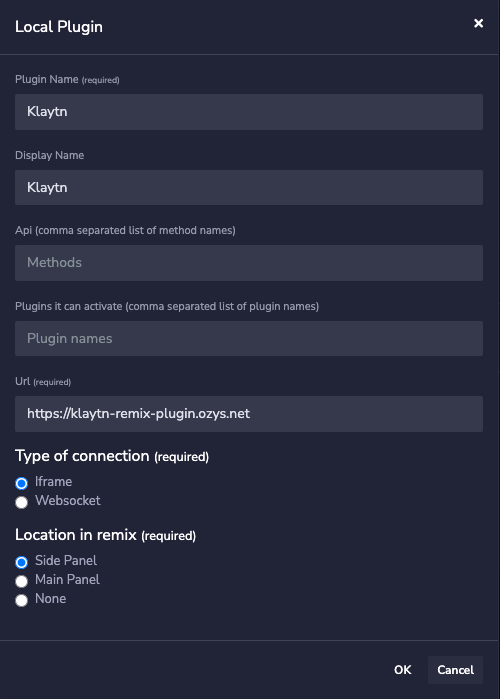
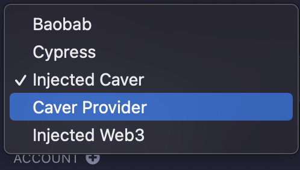

# Đang kết nối với Remix

## Remix là gì 

Remix là IDE chạy trên trình duyệt (Môi trường phát triển tích hợp) để phát triển hợp đồng Solidity. Tài liệu này sẽ trình bày việc kết nối Remix với Klaytn. Nếu bạn muốn biết thêm cách sử dụng Remix, vui lòng tham khảo[ **tài liệu Remix**](https://remix-ide.readthedocs.io/en/latest/) hoặc [**IDE Remix**](https://remix.ethereum.org/).

## Cài đặt phiên bản EVM 

Klaytn hỗ trợ hợp đồng viết trên Solidity và tương thích với phiên bản **London** của EVM. Tương tự, phiên bản Solidity từ 0.8.x trở về trước cũng được Klaytn hỗ trợ. Vì vậy, để triển khai hợp đồng trên Klaytn, hợp đồng phải được biên dịch với phiên bản EVM **London**.

* Nhấn **trình biên dịch solidity**, rồi chọn phiên bản EVM **London** trong 'Cấu hình nâng cao'.

## Kết nối với plugin cục bộ 

Bạn cần có plugin cục bộ để kết nối mạng Klaytn sử dụng Remix. Quy trình này được mô tả dưới đây:

* Nhấn **trình quản lý plugin**, rồi nhấn **Kết nối với Plugin Cục bộ**.

* Nhập https://klaytn-remix-plugin.ozys.net vào **URL**. Dùng bất kỳ tên nào bạn muốn cho **Tên Plugin** and **Tên Hiển thị**.

* Nếu tab \[Klaytn] xuất hiện, bạn đã có thể tương tác với Klaytn.

## Cài đặt Môi trường Triển khai 

* Nhấn vào tab \[Klaytn].
* Chọn \[Environment] phù hợp.
* Bạn có thể chọn **Baobab**, **Cypress**, **Tích hợp Caver**, **Nhà cung cấp Caver** hoặc **Tích hợp Web3**.
  * **\[Baobab]**: Kết nối với mạng Baobab
  * **\[Cypress]**: Kết nối với mạng Cypress
  * **\[Tích hợp Caver]**: Kết nối với mạng tích hợp caver(ví dụ: Kaikas)
  * **\[Nhà cung cấp Caver]**: Kết nối trực tiếp với node Klaytn, có hỗ trợ RPC
  * **\[Tích hợp Web3]**: Kết nối với mạng tích hợp web3(ví dụ: Metamask)

## Nhập tài khoản 

* Bạn có thể nhập khóa từ **khóa riêng tư** hoặc **Lưu trữ khóa**.
* Nhấn nút **thêm** bên cạnh **TÀI KHOẢN**.

* Rồi nhập vào khóa riêng tư hoặc Lưu trữ khóa.
* Bạn cũng có thể nhập khóa cho **người trả phí**. Hệ thống chỉ hỗ trợ **khóa riêng tư**.

## Kết nối với Klaytn - Remix bằng EN (Nút điểm cuối) 

* Cài đặt Nút điểm cuối trong môi trường cục bộ theo hướng dẫn trong [**tài liệu EN**](https://docs.klaytn.foundation/getting-started/quick-start/launch-an-en).
*   Tạo tài khoản theo hướng dẫn trong [**Quản lý Tài khoản**](https://docs.klaytn.foundation/getting-started/account).

    > **Lưu ý:** Nếu bạn sử dụng EN Công khai từ Baobab thay vì môi trường cục bộ, bạn sẽ không kết nối được với tài khoản của mình vì API cá nhân sẽ bị vô hiệu hóa.
* Chọn \[Nhà cung cấp Caver] trong menu Môi trường.

* Nhập địa chỉ RPC của EN trong Điểm cuối Nhà cung cấp Caver. EN cục bộ (mặc định): [http://localhost:8551](http://localhost:8551/)
* Khi bạn đã kết nối được với Mạng lưới, bạn sẽ thấy ID Chuỗi và Tài khoản của mạng đã kết nối.

## Kết nối với Klaytn - Remix bằng MetaMask 

* Kết nối với Klaytn bằng MetaMask theo tham khảo từ [**Kết nối với MetaMask**](https://docs.klaytn.foundation/dapp/tutorials/connecting-metamask).
* Chọn \[Tích hợp Web3] trên menu Môi trường Remix.

* Khi bạn nhìn thấy cửa sổ MetaMask bật lên, nhấn để chọn tài khoản.
* Khi bạn đã kết nối được với Mạng lưới, bạn sẽ thấy ID Chuỗi và Tài khoản của mạng đã kết nối.

## Kết nối với Klaytn - Remix bằng Kaikas 

* Chọn \[Tích hợp Caver] trên menu Môi trường Remix.

* Khi bạn thấy cửa sổ Kaikas bật lên, nhấn \[Connect].
* Khi bạn đã kết nối được với Mạng lưới, bạn sẽ thấy ID Chuỗi và Tài khoản của mạng đã kết nối.

## Hướng dẫn: Hợp đồng KlaytnGreeter 

Chúng tôi sẽ sử dụng hợp đồng mẫu [**KlaytnGreeter**](https://docs.klaytn.foundation/smart-contract/sample-contracts/klaytngreeter).

* Thêm KlaytnGreeter.sol và viết mã lệnh chạy thử.

* Trên tab Biên dịch Solidity, chọn \[Biên dịch KlaytnGreeter.sol] để biên dịch mã lệnh hợp đồng.

> Bạn nên bật tùy chọn 'Tự động biên dịch'.

* Trong tab Triển khai & Chạy Giao dịch tab, nhấn \[Deploy] để triển khai hợp đồng đã biên dịch.

* Bạn có thể xem hợp đồng đã triển khai. Bạn có thể kiểm thử hoặc gỡ lỗi hợp đồng.

