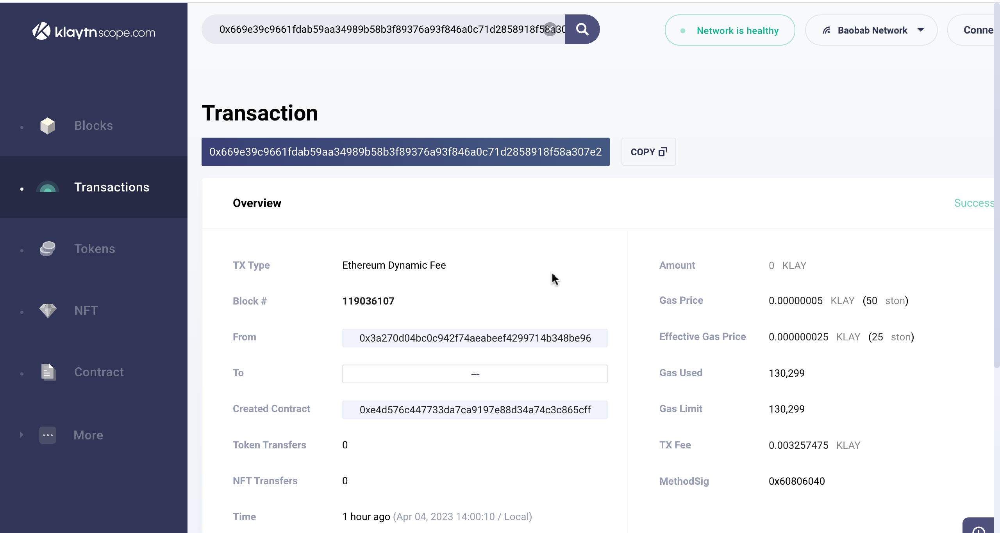
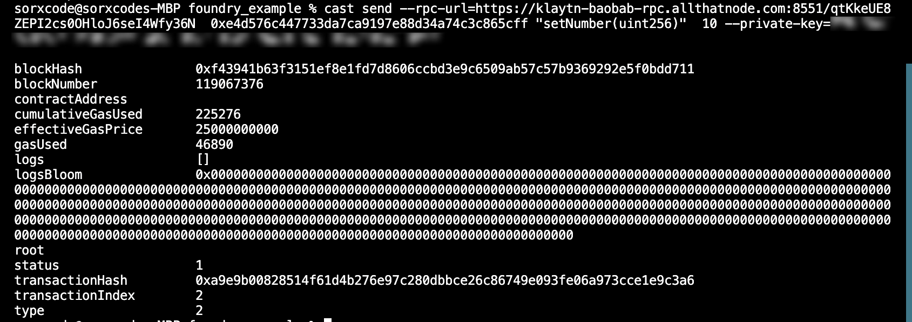

# Giới thiệu
Foundry là một khung phát triển hợp đồng thông minh, viết bằng ngôn ngữ Rust, cho phép các nhà phát triển quản lý và lập hợp đồng, chạy thử nghiệm, triển khai hợp đồng và tương tác với mạng từ dòng lệnh thông qua các mã lập trình solidity.

Foundry bao gồm bốn công cụ CLI chính, cho phép phát triển hợp đồng thông minh một cách nhanh chóng và theo mô-đun, cụ thể là:

* [Forge](https://github.com/foundry-rs/foundry/tree/master/forge): Bạn có thể triển khai, kiểm tra và lập hợp đồng thông minh bằng Forge.
* [Cast](https://github.com/foundry-rs/foundry/tree/master/cast): Cast khiến việc tương tác với các hợp đồng thông minh EVM trở nên đơn giản. Trong đó bao gồm các việc như lấy dữ liệu chuỗi, gửi giao dịch và những việc khác.
* [Anvil](https://github.com/foundry-rs/foundry/tree/master/anvil): Bạn có cần khởi động một nút cục bộ không? Anvil là một môi trường nút cục bộ do Foundry cung cấp.
* [Chisel](https://github.com/foundry-rs/foundry/blob/master/chisel): REPL solidity nhanh chóng, hữu dụng và chi tiết.

Trong hướng dẫn này, bạn sẽ:
* Tạo một dự án foundry đơn giản.
* Lập và thử nghiệm một hợp đồng thông minh mẫu bằng Foundry.
* Triển khai các hợp đồng thông minh bằng Foundry vào mạng Baobab của Klaytn.
* Khám phá việc mô phỏng mạng chính thức bằng cast và anvil.

# Điều kiện tiên quyết
Để làm theo hướng dẫn này, bạn cần đáp ứng các điều kiện tiên quyết sau:

* Trình biên tập mã: một trình biên tập mã nguồn như [VS-Code](https://code.visualstudio.com/download).
* [Metamask](https://docs.klaytn.foundation/dapp/tutorials/connecting-metamask#install-metamask): được dùng để triển khai hợp đồng, ký giao dịch và tương tác với hợp đồng.
* Điểm cuối RPC: bạn có thể nhận từ một trong những [Nhà cung cấp điểm cuối](https://docs.klaytn.foundation/content/dapp/json-rpc/public-en) được hỗ trợ.
* KLAY để thử nghiệm từ [Vòi](https://baobab.wallet.klaytn.foundation/faucet): nạp quỹ cho tài khoản của bạn với một lượng KLAY vừa đủ.
* Cài đặt [Rust](https://www.rust-lang.org/tools/install) và [Foundry](https://github.com/foundry-rs/foundry#installation).

# Thiết lập môi trường phát triển
Để kiểm tra xem việc cài đặt foundry có thành công không, hãy chạy lệnh dưới đây:

```bash
forge -V
```
**Kết quả đầu ra**


Sau khi cài đặt foundry thành công, bạn sẽ có quyền truy cập vào các công cụ CLI (forge, cast, anvil, chisel) có sẵn trong foundry. Hãy cùng lập dự án foundry bằng những bước sau:

**Bước 1**: Để bắt đầu một dự án mới, hãy chạy lệnh sau:

```bash
forge init foundry_example 
```
**Bước 2**: Điều hướng tới thư mục dự án của bạn.

```bash 
cd foundry_example
ls   
```
Sau khi khởi tạo một dự án foundry, thư mục hiện tại của bạn sẽ bao gồm:
* **src**: thư mục mặc định cho các hợp đồng thông minh của bạn.
* **tests**: thư mục mặc định cho các thử nghiệm.
* **foundry.toml**: tập tin cấu hình dự án mặc định.
* **lib**:  thư mục mặc định cho các phần phụ thuộc của dự án.
* **script**: thư mục mặc định cho các tập tin mã lập trình solidity.

# Hợp đồng thông minh mẫu
Trong phần này, chúng ta sẽ dùng hợp đồng đối ứng mẫu trong dự án foundry được khởi tạo. Tập tin `counter.sol` trong thư mục `src/` cần phải trông thế này:

```solidity
// SPDX-License-Identifier: UNLICENSED
pragma solidity ^0.8.13;
contract Counter {
    uint256 public number;
    function setNumber(uint256 newNumber) public {
        number = newNumber;
    }
    function increment() public {
        number++;
    }
}
```
**Hướng dẫn về mã**

Đây là hợp đồng thông minh của bạn. **Dòng 1** cho thấy Foundry sử dụng phiên bản Solidity 0.8.13 hoặc cao hơn. Từ **dòng 4-12**, một hợp đồng thông minh `Counter` đã được tạo. Hợp đồng này chỉ chứa một số mới bằng cách sử dụng hàm **setNumber** và tăng số đó bằng cách gọi hàm **increment**.

# Kiểm tra hợp đồng thông minh
Foundry cho phép chúng ta viết thử nghiệm bằng solidity thay vì javascript như trong các khung phát triển hợp đồng thông mình khác. Trong dự án foundry đã khởi tạo, `test/Counter.t.sol` là ví dụ về một thử nghiệm viết bằng solidity. Mã trông như thế này:

```solidity
// SPDX-License-Identifier: UNLICENSED
pragma solidity ^0.8.13;
import "forge-std/Test.sol";
import "../src/Counter.sol";
contract CounterTest is Test {
    Counter public counter;
    function setUp() public {
        counter = new Counter();
        counter.setNumber(0);
    }
    function testIncrement() public {
        counter.increment();
        assertEq(counter.number(), 1);
    }
    function testSetNumber(uint256 x) public {
        counter.setNumber(x);
        assertEq(counter.number(), x);
    }
}
```
Mã trên cho thấy bạn đã nhập thư viện tiêu chuẩn forge và Counter.sol.

Các bài kiểm tra ở trên kiểm tra các điểm sau:
* Con số đó có tăng lên không?
* Con số đó có bằng với số đặt ra không?

Để kiểm tra xem thử nghiệm của bạn có chạy ổn không, hãy chạy lệnh sau:

```bash
forge test
```
**Output**


To learn more about writing tests, advanced testing, and other features, refer to [Foundry's documentation](https://book.getfoundry.sh/forge/tests).

# Lập hợp đồng
Compile your contract with this command:

```bash
forge build 
```

# Triển khai hợp đồng

To deploy a contract using foundry, you must provide an RPC URL and a private key of the account that will deploy the contract. Take a look at the list of [rpc-providers](https://docs.klaytn.foundation/content/dapp/json-rpc/public-en) on Klaytn to find your rpc-url, and create an account using [MetaMask](https://docs.klaytn.foundation/dapp/tutorials/connecting-metamask#install-metamask).

**Step 1**: To deploy your contract to the Klaytn Baobab network, run the command below:

```bash
$ forge create --rpc-url <your_rpc_url> --private-key <your_private_key> src/Counter.sol:Counter
```

**Example**

```bash
forge create --rpc-url https://klaytn-baobab-rpc.allthatnode.com:8551/qtKkeUE8ZEPI2cs0OHloJ6seI4Wfy36N --private-key hhdhdhdhprivatekeyhdhdhdhud src/Counter.sol:Counter
```

**WARNING: Replace the private key argument with your private key from MetaMask. Be very careful not to expose your private key.**

**Output**


**Step 2**: Open [Klaytnscope](https://baobab.scope.klaytn.com/tx/0x669e39c9661fdab59aa34989b58b3f89376a93f846a0c71d2858918f58a307e2?tabId=internalTx) to check if the counter contract deployed successfully.

**Step 3**: Copy and paste the transaction hash in the search field and press Enter. You should see the recently deployed contract.



# Tương tác với hợp đồng

After successfully deploying your smart contract, you will want to call and execute functions right. Let's get to interact with the deployed contracts on Klaytn Baobab Network using [Cast](https://book.getfoundry.sh/reference/cast/cast-send.html).  In this section, you will learn how to use the [cast call](https://book.getfoundry.sh/reference/cast/cast-call) to execute the `read-only` function and [cast send](https://book.getfoundry.sh/reference/cast/cast-send) to execute `write` functions.

**A. cast call**: To get the number stored in the contract, you will be calling the `number` function. Run the command below to see this in action.

```bash
cast call YOUR_CONTRACT_ADDRESS "number()" --rpc-url RPC-API-ENDPOINT-HERE
```
**Example**

```bash
cast call 0xe4d576c447733da7ca9197e88d34a74c3c865cff "number()" --rpc-url https://klaytn-baobab-rpc.allthatnode.com:8551/qtKkeUE8ZEPI2cs0OHloJ6seI4Wfy36N
```

**Output**


You should get this data in hexadecimal format:

```bash
0x0000000000000000000000000000000000000000000000000000000000000000
```
However to get your desired result, use cast to convert the above result. In this case, the data is a number, so you can convert it into base 10 to get the result 0:

```bash
cast --to-base 0x0000000000000000000000000000000000000000000000000000000000000000 10
```
**Output**


**B. cast send**: To sign and publish a transaction such as executing a `setNumber` function in the counter contract, run the command below:

```bash
cast send --rpc-url=<RPC-URL> <CONTRACT-ADDRESS> “setNumber(uint256)” arg --private-key=<PRIVATE-KEY>
```
**Example**

```bash
cast send --rpc-url=https://klaytn-baobab-rpc.allthatnode.com:8551/qtKkeUE8ZEPI2cs0OHloJ6seI4Wfy36N  0xe4d576c447733da7ca9197e88d34a74c3c865cff "setNumber(uint256)"  10 --private-key=<private key>
```
**Output**



**Crosscheck Number**

```bash
cast call 0xe4d576c447733da7ca9197e88d34a74c3c865cff "number()" --rpc-url https://klaytn-baobab-rpc.allthatnode.com:8551/qtKkeUE8ZEPI2cs0OHloJ6seI4Wfy36N
```

**Output**


You should get this data in hexadecimal format:

```bash
0x000000000000000000000000000000000000000000000000000000000000000a
```
However to get your desired result, use cast to convert the above result. In this case, the data is a number, so you can convert it into base 10 to get the result 10:

```bash
cast --to-base 0x000000000000000000000000000000000000000000000000000000000000000a 10
```
**Output**


# Mô phỏng mạng chính thức bằng Cast và Anvil
Foundry allows us to fork the mainnet to a local development network ([Anvil](https://book.getfoundry.sh/reference/anvil/)). Also, you can interact and test with contracts on a real network using [Cast](https://book.getfoundry.sh/reference/cast/).

## Bắt đầu

Now that you have your Foundry project up and running, you can fork the mainnet (cypress) by running the command below:

```bash
anvil --fork-url rpc-url
```
**Example**
```bash
anvil --fork-url https://archive-en.cypress.klaytn.net
```
**Output**


After successfully running this command, your terminal looks like the above image. You'll have 10 accounts created with their public and private keys as well 10,000 prefunded tokens. The forked chain's RPC server is listening at `127.0.0.1:8545`.

To verify you have forked the network, you can query the latest block number:

```bash
curl --data '{"method":"eth_blockNumber","params":[],"id":1,"jsonrpc":"2.0"}' -H "Content-Type: application/json" -X POST localhost:8545 
```
You can convert the result from the task above using [hex to decimal](https://www.rapidtables.com/convert/number/hex-to-decimal.html). You should get the latest block number from the time you forked the network. To verify this, cross-reference the block number on [Klaytnscope](https://klaytnscope.com/block/118704896?tabId=txList).

## Minh họa
In this section, you will learn how to transfer oUSDC tokens from someone who holds oUSDC to an account created by Anvil (0x70997970C51812dc3A010C7d01b50e0d17dc79C8 - Bob)

**Transferring oUSDC**

Go to Klaytnscope and search for holders of oUSDC tokens (here). Let's pick a random account. In this example, we will be using `0x8e61241e0525bd45cfc43dd7ba0229b422545bca`.

Let's export our contracts and accounts as environment variables:

```bash
export BOB=0x70997970C51812dc3A010C7d01b50e0d17dc79C8
export oUSDC=0x754288077d0ff82af7a5317c7cb8c444d421d103
export oUSDCHolder=0x8e61241e0525bd45cfc43dd7ba0229b422545bca
```
We can check Bob’s balance using cast call:

```bash
cast call $oUSDC \
  "balanceOf(address)(uint256)" \
  $BOB
```
**Output**


Similarly, we can also check our oUSDC holder’s balance using cast call:

```bash
cast call $oUSDC \
  "balanceOf(address)(uint256)" \
  $oUSDCHolder
```
**Output**


Let's transfer some tokens from the lucky user to Alice using cast send:

```bash
cast rpc anvil_impersonateAccount $oUSDCHolder
cast send $oUSDC \
--from $oUSDCHolder\
  "transfer(address,uint256)(bool)" \
  $BOB \
 1000000
```
**Output**


Let's check that the transfer worked:

```bash
cast call $oUSDC \
  "balanceOf(address)(uint256)" \
  $BOB
```
**Output**


```bash
cast call $oUSDC \
  "balanceOf(address)(uint256)" \
  $oUSDCHolder
```
**Output**


For more in-depth guide on foundry, please refer to [Foundry Docs](https://book.getfoundry.sh/). Also, you can find the full implementation of the code for this guide on [GitHub](https://github.com/klaytn/examples/tree/main/foundry).

