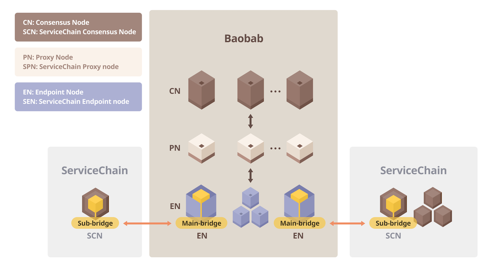
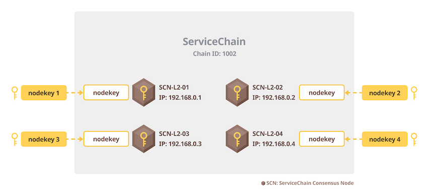

Phần này trình bày cách thiết lập Chuỗi dịch vụ đa nút. Chúng ta sẽ thiết lập Chuỗi dịch vụ 4 nút đồng thuận với `chainID` 1002, như bạn có thể thấy trong hộp viền màu xanh trong hình bên dưới.




## Điều kiện tiên quyết <a id="prerequisites"></a>
 - Tải về gói nhị phân `kscn` và `homi` từ [Tải về](../../../download/README.md).
 - 4 máy chủ Linux hoặc MacOS
 - Yêu cầu phần cứng tối thiểu
   - CPU: 4-core (Intel Xeon hoặc tương đương), RAM: 16GB, HDD: 50GB
   - Vui lòng tham khảo [Yêu cầu hệ thống](../references/system-requirements.md) để biết thêm chi tiết.

## Bước 0: Cài đặt SCN trên tất cả các nút <a id="install-scn"></a>
Quá trình cài đặt chính là giải nén gói đã tải xuống. Giải nén SCN trên mỗi máy chủ.

```console
$ tar xvf kscn-vX.X.X-XXXXX-amd64.tar.gz
x kscn-XXXXX-amd64/
x kscn-XXXXX-amd64/conf/
x kscn-XXXXX-amd64/conf/kscnd.conf
x kscn-XXXXX-amd64/bin/
x kscn-XXXXX-amd64/bin/kscnd
x kscn-XXXXX-amd64/bin/kscn
```

Để thuận tiện, chúng tôi sẽ thêm đường dẫn nhị phân vào $PATH. Sử dụng đường dẫn thự trên nút của bạn.
```console
$ export PATH=$PATH:~/path/to/kscn-XXXXX-amd64/bin
```

SCN cũng cung cấp nhiều trình phân bổ RPM như RHEL, CentOS và Fedora. Để biết thêm thông tin, vui lòng tham khảo [Cài đặt](../references/scn/installation.md).

```console
$ curl -o /etc/yum.repos.d/klaytn.repo https://packages.klaytn.net/config/rhel/7/prod.repo
  % Total % Received % Xferd Average Speed Time Time Time Current Dload Upload Total Spent Left Speed
     100 118 100 118 0 0 1113 0 --:--:-- --:--:-- --:--:-- 1102 

$ yum list | grep klaytn 
packages-klaytn-prod 31 kB/s | 2.9 kB 00:00 
homi.x86_64           v1.8.0-0.el7      packages-klaytn-prod 
kbnd.x86_64           v1.8.0-0.el7      packages-klaytn-prod 
kcnd.x86_64           v1.8.0-0.el7      packages-klaytn-prod 
kcnd-baobab.x86_64    v1.8.0-0.el7      packages-klaytn-prod 
kend.x86_64           v1.8.0-0.el7      packages-klaytn-prod 
kend-baobab.x86_64    v1.8.0-0.el7      packages-klaytn-prod 
kgen.x86_64           v1.8.0-0.el7      packages-klaytn-prod 
kpnd.x86_64           v1.8.0-0.el7      packages-klaytn-prod 
kpnd-baobab.x86_64    v1.8.0-0.el7      packages-klaytn-prod 
kscnd.x86_64          v1.8.0-0.el7      packages-klaytn-prod 
ksend.x86_64          v1.8.0-0.el7      packages-klaytn-prod 
kspnd.x86_64          v1.8.0-0.el7      packages-klaytn-prod 

$ yum install kscnd
```

## Bước 1: Tạo genesis.json và khóa nút <a id="step-1-create-genesis-json-and-a-key"></a>

Chúng ta sẽ sử dụng tiện ích homi để tạo ra các tập tin cần thiết. `homi` là tiện ích tự động tạo tập lệnh, tập tin cấu hình và khóa riêng tư cần thiết để định cấu hình blockchain Klaytn. Bạn có thể thực thi homi từ bất kỳ máy bàn Linux/Mac nào.

Đầu tiên, giải nén tập tin homi mà bạn đã tải xuống.
```console
$ tar xvf homi-vX.X.X-XXXXX-amd64.tar.gz
x homi-XXXXX-amd64/
x homi-XXXXX-amd64/bin/
x homi-XXXXX-amd64/bin/homi
```

Chuyển đến thư mục `bin` và thực thi `homi` với các tùy chọn sau để tạo tập tin. `homi setup local --cn-num 4 --test-num 1 --servicechain --chainID 1002 --p2p-port 22323 -o homi-output` Vì `chainID` của Baobab là 1001, để thuận tiện, `chainID` của Chuỗi dịch vụ trong ví dụ này được đặt là 1002. Khi vận hành một blockchain bằng cách khởi chạy một dịch vụ thực tế, bạn nên sử dụng dịch vụ đó sau khi đăng ký giá trị chainID mới tại https://chainlist.defillama.com/ để chainID không trùng lặp với các Chuỗi dịch vụ khác. Cổng chuỗi dịch vụ được đặt là 22323 hay chính là cổng mặc định.

```console
$ ./homi setup local --cn-num 4 --test-num 1 --servicechain --chainID 1002 --p2p-port 22323 -o homi-output
Created :  homi-output/keys/passwd1
Created :  homi-output/keys/passwd2
Created :  homi-output/keys/passwd3
Created :  homi-output/keys/passwd4
Created :  homi-output/scripts/genesis.json
Created :  homi-output/keys/nodekey1
Created :  homi-output/keys/validator1
Created :  homi-output/keys/nodekey2
Created :  homi-output/keys/validator2
Created :  homi-output/keys/nodekey3
Created :  homi-output/keys/validator3
Created :  homi-output/keys/nodekey4
Created :  homi-output/keys/validator4
Created :  homi-output/scripts/static-nodes.json
Created :  homi-output/keys_test/testkey1
Created :  homi-output/keys_test/keystore1/0xdC7218621513f71d609653d22C39d79d558d9CDC
Created :  homi-output/Klaytn.json
Created :  homi-output/Klaytn_txpool.json
```

Trong số các đầu ra, chúng ta sẽ sử dụng `nodekey*`, `genesis.json` và `static-nodes.json` trong các bước tiếp theo.


## Bước 2: Tùy chỉnh static-nodes.json <a id="step-2-customize-static-nodes-json"></a>

Mở `homi-output/scripts/static-nodes.json` trong trình soạn thảo văn bản, rồi cập nhật địa chỉ IP và cổng bằng giá trị thực của các nút của bạn. Trong ví dụ này, giả định rằng IP của mỗi nút SCN trong Chuỗi dịch vụ giồng như trong hình bên dưới. Hãy nhớ cổng bạn đã gán ở đây vì nó sẽ được sử dụng sau trong bước 4.


```json
[
     "kni://38693ad4b17ff77...23153@192.168.0.1:22323?discport=0\u0026ntype=cn",
     "kni://f36d969b16f7337...1329b@192.168.0.2:22323?discport=0\u0026ntype=cn",
     "kni://16e55d8921ab034...b2bec@192.168.0.3:22323?discport=0\u0026ntype=cn",
     "kni://0973e792a421c1d...bbd71@192.168.0.4:22323?discport=0\u0026ntype=cn"
]
```

Sau khi bạn cập nhật `static-nodes.json`, hãy tải các thư mục đầu ra(`homi-output`) lên tất cả các SCN, tức là nút SCN-L2-01, SCN-L2-02, SCN-L2-03, SCN-L2-04 trong ví dụ này.

```console
$ scp -r path/to/homi-output/ user@192.168.0.1:~/
$ scp -r path/to/homi-output/ user@192.168.0.2:~/
$ scp -r path/to/homi-output/ user@192.168.0.3:~/
$ scp -r path/to/homi-output/ user@192.168.0.4:~/
```

## Bước 3: Khởi tạo nút <a id="step-3-node-initialization"></a>
Bây giờ, chúng ta sẽ khởi tạo từng nút bằng tệp khởi nguyên. Trên mỗi nút, hãy thực hiện lệnh sau. Điều này sẽ tạo thư mục dữ liệu lưu trữ dữ liệu chuỗi và nhật ký trên thư mục chủ của bạn. Bạn có thể thay đổi thư mục dữ liệu bằng lệnh dẫn hướng `--datadir`. Trong ví dụ này, chúng ta đặt thư mục dữ liệu thành `\~/data`.

```console
$ kscn --datadir ~/data init ~/homi-output/scripts/genesis.json

$ ls ~/data
keystore    klay        kscn
```


## Bước 4: Cài đặt `nodekey` và `static-nodes.json` <a id="step-4-install-nodekey"></a>

Trên mỗi SCN, hãy sao chép `static-nodes.json` vào thư mục dữ liệu.
```console
$ cp ~/homi-output/scripts/static-nodes.json ~/data/
```

Ở bước 1, chúng ta đã tạo 4 khóa nút. Gán từng khóa nút cho SCN và sao chép `nodekey` phù hợp vào từng thư mục dữ liệu của SCN. Ví dụ: sử dụng `nodekey1` cho nút SCN-L2-01(192.168.0.1) và sử dụng `nodekey2`, `nodekey3` và `nodekey4` tương ứng cho SCN-L2-02(192.168.0.2), SCN-L2-03(192.168.0.3) và SCN-L2-04(192.168.0.4).
```console
$ cp ~/homi-output/keys/nodekey{1..4} ~/data/klay/nodekey
```



## Bước 5: Định cấu hình nút <a id="step-5-configure-nodes"></a>

Trên mỗi SCN, chuyển tới thư mục cài đặt kscn và chỉnh sửa `conf/kscnd.conf` như sau. `PORT` là cổng dùng để thiết lập `homi` và `SC_SUB_BRIDGE` cần thiết để kết nối cầu nối trrorng phần tiếp theo. Hiện tại, chỉ cần đặt nó thành 0. Trong `DATA_DIR`, nhập thư mục dữ liệu được sử dụng trrong bước 3.
```
...
PORT=22323
...
SC_SUB_BRIDGE=0
...
DATA_DIR=~/data
...
```

## Bước 6: Bắt đầu nút <a id="step-6-start-nodes"></a>
Thực hiện lệnh sau trên tất cả các nút SCN.
```console
$ kscnd start
Starting kscnd: OK
```
Bạn có thể kiểm tra trạng thái tạo khối bằng cách xem `klay.blockNumber`. Nếu số này không phải là 0 thì nút đang hoạt động bình thường.
```console
$ kscn attach --datadir ~/data
> klay.blockNumber
10
```
Nếu bạn muốn dừng một nút, bạn có thể sử dụng lệnh `kscnd stop`

## (Ví dụ) Tạo và xác nhận giao dịch chuyển giá trị <a id="example-creation-and-confirmation-of-a-value-transfer-transaction"></a>
Bây giờ, Chuỗi dịch vụ 4 nút đã hoạt động. Chúng ta sẽ thực hiện giao dịch chuyển giá trị trong Chuỗi dịch vụ để xác nhận cài đặt.


### Bước 1: Nhập tài khoản thử nghiệm <a id="step-1-import-the-test-account"></a>
`testkey1` được tạo tự động bởi `homi` ở bước 1. KLAY được phân bổ cho tài khoản thử nghiệm như được mô tả trong `genesis.json` và được tạo bởi `homi`.


```console
$ kscn account import --datadir ~/data ~/homi-output/keys_test/testkey1
Tài khoản mới của bạn được khóa bằng mật khẩu. Vui lòng nhập mật khẩu. Đừng quên mật khẩu này.
Cụm mật khẩu:
Nhắc lại cụm mật khẩu:
Địa chỉ: {80119c31cdae67c42c8296929bb4f89b2a52cec4}
```

### Bước 2: Mở khóa tài khoản <a id="step-2-unlock-the-account"></a>
Chỉ có thể mở khóa tài khoản thông qua bảng điều khiển của nút SCN đã nhập `testkey1`.
```console
$ kscn attach --datadir ~/data
> personal.unlockAccount("80119c31cdae67c42c8296929bb4f89b2a52cec4")
Unlock account 80119c31cdae67c42c8296929bb4f89b2a52cec4
Passphrase:
true
```

### Bước 3: Gửi giao dịch và kiểm tra số dư <a id="step-3-send-a-transaction-and-check-the-balance"></a>
```console
> klay.sendTransaction({from: "80119c31cdae67c42c8296929bb4f89b2a52cec4", to: "305c6cc464d5fe1e624679695a20d641a01688e1", value: 10})
"0xa0e7102e8f14200cec8d964aacc1c9ed7c22271078b2b213170c64333cbca8a3"
> klay.getBalance("305c6cc464d5fe1e624679695a20d641a01688e1")
10
```


Hình thức đơn giản nhất của Chuỗi dịch vụ là có một SCN. Chuỗi dịch vụ được minh họa trong hướng dẫn này là Chuỗi dịch vụ 4 nút. Tuy nhiên, bạn có thể thiết lập Chuỗi dịch vụ một nút nếu muốn. Chỉ cần chuyển `--cn-num 1` thay vì `--cn-num 4` cho homi trong "Bước 1:Tạo genesis.json và khóa nút".

Cần ít nhất 4 nút để kháng lỗi byzantine. Do đó, số lượng SCN tối thiểu để đạt được tính sẵn sàng cao theo thuật toán BFT là 4. Có 2 nút SCN là không đủ, bởi vì nếu một SCN bị lỗi thì nút còn lại sẽ không thể đạt được sự đồng thuận.
