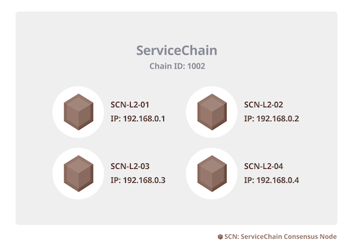
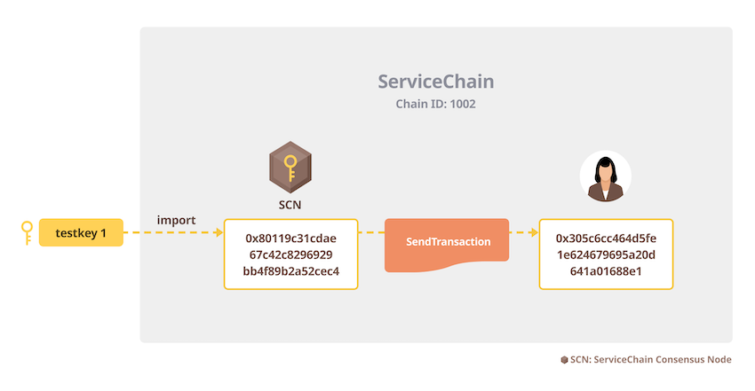

This section covers how to set up a multi-node ServiceChain. We will set up a 4-consensus-node ServiceChain with `chainID` 1002, as you can see in the blue border box in the figure below.


## Prerequisites <a id="prerequisites"></a>
 - Download packages for `kscn`, `homi` binary from [Download](../../../download/README.md).
 - 4 Linux or MacOS servers
 - Minimum hardware requirements
   - CPU: 4-core (Intel Xeon or equivalent), RAM: 16GB, HDD: 50GB
   - Please refer to [System Requirements](../references/system-requirements.md) for more explanation.

## Step 0: Install SCN on all nodes <a id="install-scn"></a>
The installation is the uncompression of the downloaded package. Extract the SCN archive on each server.

```console
$ tar xvf kscn-vX.X.X-XXXXX-amd64.tar.gz
x kscn-XXXXX-amd64/
x kscn-XXXXX-amd64/conf/
x kscn-XXXXX-amd64/conf/kscnd.conf
x kscn-XXXXX-amd64/bin/
x kscn-XXXXX-amd64/bin/kscnd
x kscn-XXXXX-amd64/bin/kscn
```

For the convenience, we will add the binary path to $PATH. Use the actual path on your node.
```console
$ export PATH=$PATH:~/path/to/kscn-XXXXX-amd64/bin
```

SCN also provides various RPM distributions like RHEL, CentOS, and Fedora. For more information, please refer to [Installation](../references/scn/installation.md).

```console
$ curl -o /etc/yum.repos.d/klaytn.repo https://packages.klaytn.net/config/rhel/7/prod.repo
  % Total % Received % Xferd Average Speed Time Time Time Current Dload Upload Total Spent Left Speed
     100 118 100 118 0 0 1113 0 --:--:-- --:--:-- --:--:-- 1102 

$ yum list | grep klaytn 
packages-klaytn-prod 31 kB/s | 2.9 kB 00:00 
homi.x86_64           v1.8.0-0.el7      packages-klaytn-prod 
kbnd.x86_64           v1.8.0-0.el7      packages-klaytn-prod 
kcnd.x86_64           v1.8.0-0.el7      packages-klaytn-prod 
kcnd-baobab.x86_64    v1.8.0-0.el7      packages-klaytn-prod 
kend.x86_64           v1.8.0-0.el7      packages-klaytn-prod 
kend-baobab.x86_64    v1.8.0-0.el7      packages-klaytn-prod 
kgen.x86_64           v1.8.0-0.el7      packages-klaytn-prod 
kpnd.x86_64           v1.8.0-0.el7      packages-klaytn-prod 
kpnd-baobab.x86_64    v1.8.0-0.el7      packages-klaytn-prod 
kscnd.x86_64          v1.8.0-0.el7      packages-klaytn-prod 
ksend.x86_64          v1.8.0-0.el7      packages-klaytn-prod 
kspnd.x86_64          v1.8.0-0.el7      packages-klaytn-prod 

$ yum install kscnd
```

## Step 1: Create genesis.json and nodekeys <a id="step-1-create-genesis-json-and-a-key"></a>

We will use homi utility to generate the needful files. `homi` is a utility that automatically generates scripts, configuration files, and private keys necessary to configure the Klaytn blockchain. You can execute homi from any Linux/Mac PC.

First, extract the homi archive you downloaded.
```console
$ tar xvf homi-vX.X.X-XXXXX-amd64.tar.gz
x homi-XXXXX-amd64/
x homi-XXXXX-amd64/bin/
x homi-XXXXX-amd64/bin/homi
```

Go to the `bin` folder and execute `homi` with following options to generate the files. `homi setup local --cn-num 4 --test-num 1 --servicechain --chainID 1002 --p2p-port 22323 -o homi-output` Since Baobab's `chainID` is 1001, for convenience, the `chainID` of the ServiceChain constructed in this example is set to 1002. When operating a blockchain by launching an actual service, it is recommended to use it after registering a new chainID value at https://chainlist.defillama.com/ so that chainID does not overlap with other ServiceChains. The ServiceChain port is set to 22323, which is the default port.

```console
$ ./homi setup local --cn-num 4 --test-num 1 --servicechain --chainID 1002 --p2p-port 22323 -o homi-output
Created :  homi-output/keys/passwd1
Created :  homi-output/keys/passwd2
Created :  homi-output/keys/passwd3
Created :  homi-output/keys/passwd4
Created :  homi-output/scripts/genesis.json
Created :  homi-output/keys/nodekey1
Created :  homi-output/keys/validator1
Created :  homi-output/keys/nodekey2
Created :  homi-output/keys/validator2
Created :  homi-output/keys/nodekey3
Created :  homi-output/keys/validator3
Created :  homi-output/keys/nodekey4
Created :  homi-output/keys/validator4
Created :  homi-output/scripts/static-nodes.json
Created :  homi-output/keys_test/testkey1
Created :  homi-output/keys_test/keystore1/0xdC7218621513f71d609653d22C39d79d558d9CDC
Created :  homi-output/Klaytn.json
Created :  homi-output/Klaytn_txpool.json
```

Among the outputs, we will use `nodekey*`, `genesis.json` and `static-nodes.json` in the subsequent steps.


## Step 2: Customize static-nodes.json <a id="step-2-customize-static-nodes-json"></a>

Open `homi-output/scripts/static-nodes.json` in a text editor then update the IP addresses and ports with the actual values of your nodes. In this example, it is assumed that the IP of each SCN node in the ServiceChain is as shown in the figure below. Remember the port you assigned here, as it will be used later in step 4.



```json
[
     "kni://38693ad4b17ff77...23153@192.168.0.1:22323?discport=0\u0026ntype=cn",
     "kni://f36d969b16f7337...1329b@192.168.0.2:22323?discport=0\u0026ntype=cn",
     "kni://16e55d8921ab034...b2bec@192.168.0.3:22323?discport=0\u0026ntype=cn",
     "kni://0973e792a421c1d...bbd71@192.168.0.4:22323?discport=0\u0026ntype=cn"
]
```

After you update `static-nodes.json`, upload the output folders(`homi-output`) to all SCNs, i.e. SCN-L2-01, SCN-L2-02, SCN-L2-03, SCN-L2-04 nodes in this example.

```console
$ scp -r path/to/homi-output/ user@192.168.0.1:~/
$ scp -r path/to/homi-output/ user@192.168.0.2:~/
$ scp -r path/to/homi-output/ user@192.168.0.3:~/
$ scp -r path/to/homi-output/ user@192.168.0.4:~/
```

## Step 3: Node initialization <a id="step-3-node-initialization"></a>
Now, we will initialize each node using the genesis file. On each node, execute the following command. It will create the data folder storing the chain data and logs on your home directory. You can change the data folder using the `--datadir` directive. In this example, we set the data folder to `\~/data`.

```console
$ kscn --datadir ~/data init ~/homi-output/scripts/genesis.json

$ ls ~/data
keystore    klay        kscn
```


## Step 4: Install `nodekey` and `static-nodes.json` <a id="step-4-install-nodekey"></a>

On every SCNs, copy `static-nodes.json` to the data folder.
```console
$ cp ~/homi-output/scripts/static-nodes.json ~/data/
```

In step 1, we generated 4 nodekeys. Assign each node key to the SCN and copy the matching `nodekey` to each SCN's data folder. For example, use `nodekey1` for SCN-L2-01(192.168.0.1) node and use `nodekey2`, `nodekey3` and `nodekey4` for SCN-L2-02(192.168.0.2), SCN-L2-03(192.168.0.3) and SCN-L2-04(192.168.0.4) respectively.
```console
$ cp ~/homi-output/keys/nodekey{1..4} ~/data/klay/nodekey
```


## Step 5: Configure nodes <a id="step-5-configure-nodes"></a>

On every SCNs, go to the kscn installation folder and edit `conf/kscnd.conf` as follows. `PORT` is the port used to set up `homi`, and `SC_SUB_BRIDGE` is required for connecting bridges in the next section. For now, just set it to 0. In `DATA_DIR`, enter the data folder used in step 3.
```
...
PORT=22323
...
SC_SUB_BRIDGE=0
...
DATA_DIR=~/data
...
```

## Step 6: Start nodes <a id="step-6-start-nodes"></a>
Execute the following command on all SCN nodes.
```console
$ kscnd start
Starting kscnd: OK
```
You can check block generation status by watching `klay.blockNumber`. If this number is not 0, the node is working fine.
```console
$ kscn attach --datadir ~/data
> klay.blockNumber
10
```
If you want to stop a node, you can use the command `kscnd stop`

## (Example) Creation and confirmation of a value transfer transaction <a id="example-creation-and-confirmation-of-a-value-transfer-transaction"></a>
Now the 4-node ServiceChain is up and running. We will execute a value transfer transaction in the ServiceChain to confirm the installation.



### Step 1: Import the test account <a id="step-1-import-the-test-account"></a>
`testkey1` was automatically generated by `homi` in step 1. KLAY is allocated to the test account as described in the `genesis.json` which was also generated by `homi`.


```console
$ kscn account import --datadir ~/data ~/homi-output/keys_test/testkey1
Your new account is locked with a password. Please give a password. Do not forget this password.
Passphrase:
Repeat passphrase:
Address: {80119c31cdae67c42c8296929bb4f89b2a52cec4}
```

### Step 2: Unlock the account <a id="step-2-unlock-the-account"></a>
Unlocking the account is possible only through the console of the SCN node that imported `testkey1`.
```console
$ kscn attach --datadir ~/data
> personal.unlockAccount("80119c31cdae67c42c8296929bb4f89b2a52cec4")
Unlock account 80119c31cdae67c42c8296929bb4f89b2a52cec4
Passphrase:
true
```

### Step 3: Send a transaction and check the balance <a id="step-3-send-a-transaction-and-check-the-balance"></a>
```console
> klay.sendTransaction({from: "80119c31cdae67c42c8296929bb4f89b2a52cec4", to: "305c6cc464d5fe1e624679695a20d641a01688e1", value: 10})
"0xa0e7102e8f14200cec8d964aacc1c9ed7c22271078b2b213170c64333cbca8a3"
> klay.getBalance("305c6cc464d5fe1e624679695a20d641a01688e1")
10
```


The simplest form of ServiceChain is having one SCN. The ServiceChain illustrated in this tutorial is a 4-node ServiceChain. You can, however, set up a single-node ServiceChain if you wish. Simply pass `--cn-num 1` instead of `--cn-num 4` to homi in 'Step 1:Create genesis.json and nodekeys'.

At least 4 nodes are required to tolerate byzantine faults. Therefore, the minimum number of SCNs to achieve high availability under the BFT algorithm is 4. Having 2 SCN nodes is not enough, because if one SCN fails, the other one cannot reach a consensus on its own.
