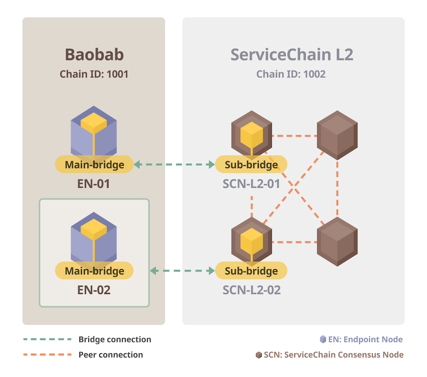
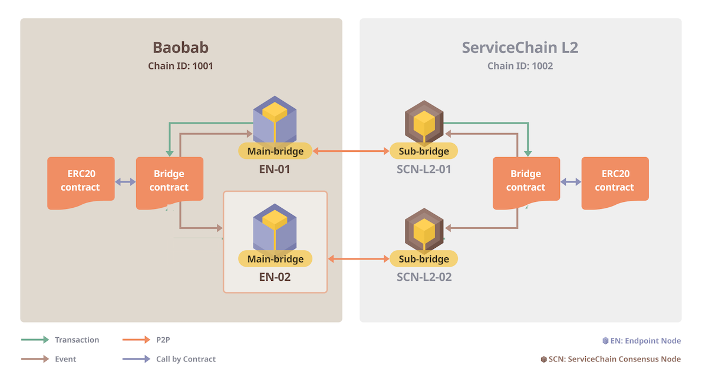
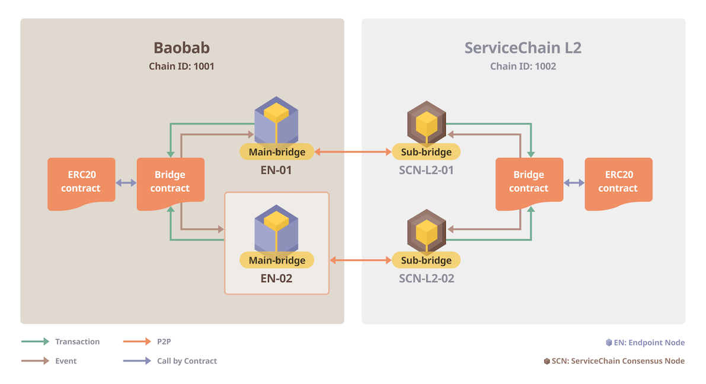

Nếu chỉ có một cầu nối được sử dụng trong ServiceChain thì cầu nối đó có thể trở thành một điểm lỗi duy nhất. Để giải quyết vấn đề này, chúng tôi sẽ mô tả cách bạn có thể xây dựng hệ thống HA với hai hoặc nhiều cầu nối. Như minh họa trong hình bên dưới, hãy định cấu hình các cầu nối được kết nối thành ít nhất hai cặp để ngay cả khi có sự cố trong một kết nối cầu nối, việc neo dữ liệu và chuyển giá trị giữa các chuỗi vẫn có thể hoạt động bình thường qua cầu nối còn lại.


## Điều kiện tiên quyết <a id="prerequisites"></a>
 - Cầu nối chính của EN và cầu nối con của SCN phải được kết nối. Nếu chúng không được kết nối, vui lòng tham khảo [Kết nối Baobab](en-scn-connection.md) để thiết lập kết nối.
 - Phần này mô tả cách thêm một cầu nối bổ sung giữa Baobab và ServiceChain. Tương tự, bạn cũng có thể thiết lập HA bằng cách thêm một cầu nối khác.

## Bước 1: Thêm một cầu nối khác giữa EN-SCN <a id="step-1-adding-another-bridge-between-en-scn"></a>

Trong [Kết nối với Baobab](en-scn-connection.md), chúng ta giả sử rằng EN và SCN được kết nối bằng cầu nối tương ứng là EN-01 và SCN-L2-01. Trong phần này, chúng ta sẽ thêm một cầu nối khác giữa EN-02 và SCN-L2-02. Vì quy trình giống nhau nên ta sẽ chỉ giải thích ngắn gọn.




Sau khi xây dựng EN-02, hãy đặt `SC_MAIN_BRIDGE` thành 1 trong `conf/kend.conf` và khởi động lại ken trên EN-02.

```console
SC_MAIN_BRIDGE=1
```

Kiểm tra thông tin KNI của EN-02 bằng lệnh sau:


```console
EN-02$ ken attach --datadir ~/data
> mainbridge.nodeInfo.kni
"kni://eb8f21df10c6562...25bae@[::]:50505?discport=0"
```

Đăng nhập vào SCN-L2-02 và tạo `main-bridges.json` bằng KNI của EN-02. Vui lòng đảm bảo rằng nó phải ở định dạng mảng JSON với dấu ngoặc vuông.


```console
SCN-L2-02$ echo '["kni://eb8f21df10c6562...25bae@192.168.0.5:50505?discport=0"]' > ~/data/main-bridges.json
```

Trên tập lệnh shell của SCN-L2-02, chỉnh sửa `kscn-XXXXX-amd64/conf/kscnd.conf` như bên dưới. Để kết nối cầu nối, hãy đặt `SC_SUB_BRIDGE` thành 1. `SC_PARENT_CHAIN_ID` được đặt thành `chainID` 1001 của Baobob. `SC_ANCHORING_PERIOD` là tham số quyết định khoảng thời gian gửi giao dịch neo đến chuỗi mẹ. Trong ví dụ này, một giao dịch neo được gửi đến chuỗi mẹ (Baobab) sau mỗi 10 khối con.
```
...
SC_SUB_BRIDGE=1
...
SC_PARENT_CHAIN_ID=1001
...
SC_ANCHORING_PERIOD=10
...
```


Nếu bạn khởi động lại ken trên EN-02, một cầu nối sẽ được kết nối tự động giữa EN-02 và SCN-L2-02 và quá trình neo dữ liệu sẽ bắt đầu từ điểm kết nối được tạo như minh họa trong hình bên dưới.

Sau khi thêm cầu nối giữa EN-02 và SCN-L2-02, bạn có thể thấy kết nối giữa các nút được thiết lập như minh họa bên dưới.


## Bước 2: Đăng ký và đặt mua Hợp đồng cầu nối <a id="step-2-registering-and-subscribing-the-bridge-contract"></a>

Như minh họa trong hình trên, hợp đồng cầu nối chỉ được đăng ký trong EN-01 và SCN-L2-01.

Kết nối với bảng điều khiển SCN-L2-02 và chạy các API để đăng ký cầu nối, đặt mua cầu nối và đăng ký token. Hợp đồng cầu nối và token được tạo trong khi triển khai hợp đồng cầu nối với EN-01 và SCN-L2-01 ở bước 2 của [Chuyển giá trị chuỗi chéo](value-transfer.md).

```
$ kscn attach --datadir ~/data
> subbridge.registerBridge("0xCHILD_BRIDGE_ADDR", "0xPARENT_BRIDGE_ADDR")
null
> subbridge.subscribeBridge("0xCHILD_BRIDGE_ADDR", "0xPARENT_BRIDGE_ADDR")
null
> subbridge.registerToken("0xCHILD_BRIDGE_ADDR", "0xPARENT_BRIDGE_ADDR", "0xCHILD_TOKEN_ADDR", "0XPARENT_TOKEN_ADDR")
null
```



Trong hợp đồng cầu nối, cần cập nhật thông tin về việc thêm một cầu nối bổ sung. Ghi thông tin người vận hành con và người vận hành mẹ của cầu nối bổ sung được thêm vào trong tập tin `erc20/erc20-addOperator4HA.js` của [service-chain-value-transfer-example](https://github.com/klaytn/servicechain-value-transfer-examples) và thực thi `node erc20-addOperator4HA.js`.

```
// register operator
await conf.child.newInstanceBridge.methods.registerOperator("0xCHILD_BRIDGE_ADDR").send({ from: conf.child.sender, gas: 100000000, value: 0 });
await conf.parent.newInstanceBridge.methods.registerOperator("0xPARENT_BRIDGE_ADDR").send({ from: conf.parent.sender, gas: 100000000, value: 0 });
```

Khi có nhiều cầu nối, việc chuyển giá trị có thể được thực hiện an toàn hơn bằng cách đặt một ngưỡng. Chỉ có thể kích hoạt chuyển giá trị khi một người vận hành trên ngưỡng yêu cầu chuyển giá trị như bình thường. Ví dụ: như trong ví dụ hiện tại, nếu có hai cặp cầu nối và ngưỡng được đặt thành 2, chỉ có thể thực hiện việc chuyển giá trị khi cả hai được yêu cầu như bình thường. Nghĩa là, ngay cả khi một cầu nối bị tấn công và gửi một yêu cầu bất thường, điều này vẫn có thể được ngăn chặn. Giá trị mặc định của ngưỡng là 1. Trong tập tin `erc20/erc20-addOperator4HA.js` của [service-chain-value-transfer-example](https://github.com/klaytn/servicechain-value-transfer-examples), hãy bỏ ghi chú mã bên dưới và đặt giá trị ngưỡng rồi chạy mã đó để thay đổi ngưỡng cho hợp đồng cầu nối.

```
// // set threshold
// await conf.child.newInstanceBridge.methods.setOperatorThreshold(0, "your threshold number").send({ from: conf.child.sender, gas: 100000000, value: 0 });
// await conf.parent.newInstanceBridge.methods.setOperatorThreshold(0, "your threshold number").send({ from: conf.parent.sender, gas: 100000000, value: 0 });
```


Khi quá trình đăng ký hoàn tất, hợp đồng cầu nối được đăng ký trong cả EN-02 và SCN-L2-02 như minh họa trong hình bên dưới để định cấu hình HA.




Khi hai hoặc nhiều cặp cầu nối được kết nối cho HA, các giao dịch neo dữ liệu cho cùng một khối có thể xảy ra nhiều lần và các giao dịch chuyển giá trị cũng có thể xảy ra nhiều lần. Bởi vậy cần trả phí bổ sung.