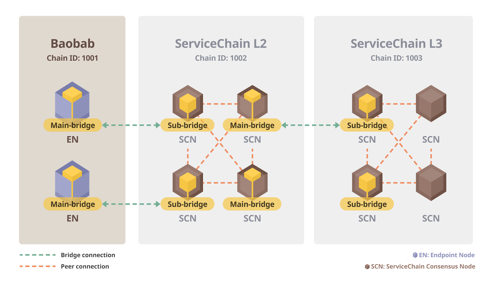
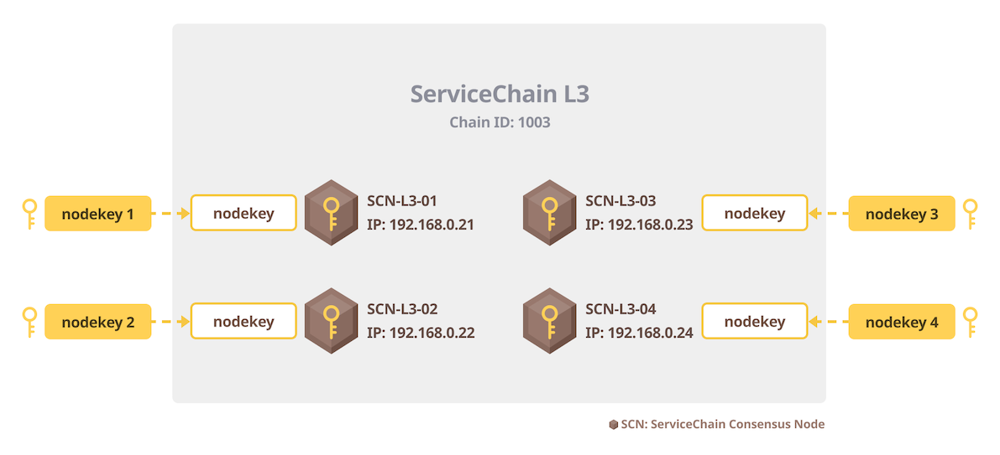
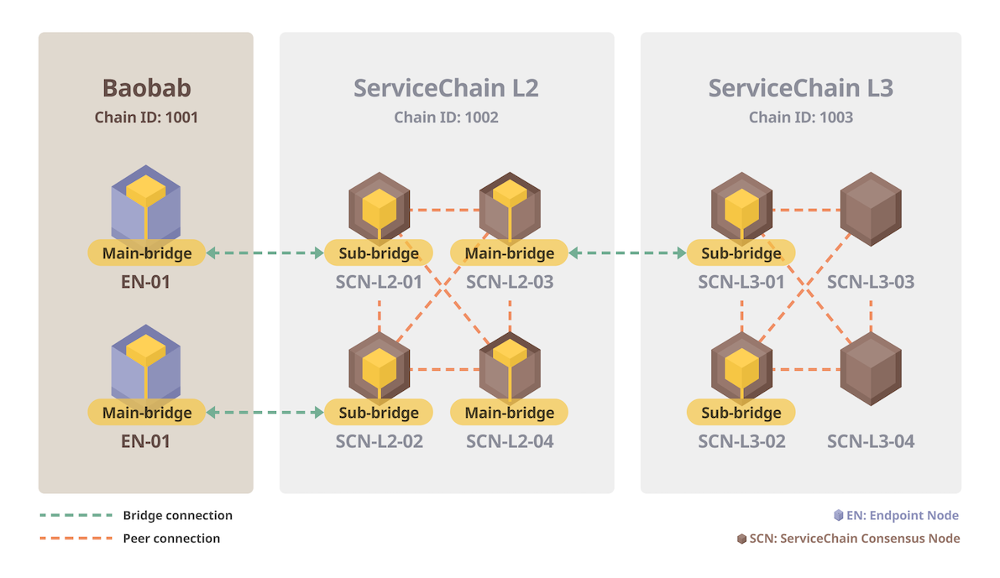
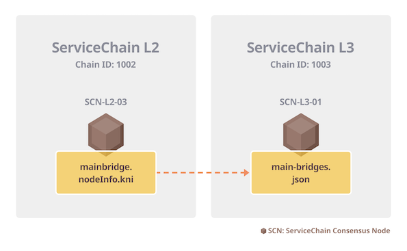

Chương này giải thích cách xây dựng mạng lưới ServiceChain theo cấu trúc phân cấp bằng cách thêm mạng lưới ServiceChain mới vào mạng lưới ServiceChain đã được xây dựng trong chương trước. Trong ví dụ này, mạng lưới ServiceChain được thêm vào cũng bao gồm 4 SCN. Mạng lưới ServiceChain được xây dựng trong chương trước là L2 còn Mạng lưới ServiceChain mới được xây dựng sẽ là L3. Chúng ta sẽ kết nối một cầu nối giữa L2 và L3 để tạo ra một cấu trúc phân cấp. Cấu trúc tổng thể của mạng lưới ServiceChain được xây dựng trong chương này sẽ như trong hình bên dưới.




## Điều kiện tiên quyết <a id="prerequisites"></a>
 - Giả sử rằng bạn đã chuyển sang cấu hình ServiceChain và EN Baobab được mô tả trong [ServiceChain lồng nhau](nested-sc.md). Vì vậy, chúng ta sẽ giải thích ngắn gọn những gì đã được giải thích trong phần trước.
 - Giả định và hạn chế
   - Một EN có thể kết nối trực tiếp với một trong các SCN của ServiceChain L2. Tương tự, một SCN trong L2 của ServiceChain có thể kết nối một-một với một trong các SCN trong L3.
   - Một nút SCN có thể có một cầu chính và cả một cầu nối con. Tuy nhiên, số cổng của cầu nối chính và cầu nối con phải được đặt khác nhau. (Ví dụ: cầu nối chính: 50505, cầu nối con: 50506)
   - Không phải tất cả các SCN trong L2 đều cần có cầu nối tới EN và tương tự như vậy, không phải tất cả các SCN trong L3 đều cần cầu nối tới L2. Tuy nhiên, để đạt được tính sẵn sàng cao, nên có hai hoặc nhiều cặp cầu nối chính và cầu nối con giữa các chuỗi. Trong chương này, chỉ một cặp sẽ được kết nối giữa L2 và L3 và tính sẵn sàng cao giữa L2 và L3 cũng giống như HA giữa Baobab và L2.

## Bước 1: Tạo và cập nhật dữ liệu Homi cho L3 <a id="step-1-create-and-update-homi"></a>
Giống như khi định cấu hình ServiceChain L2, hãy thực thi lệnh `homi` để tạo tập lệnh và tập tin cấu hình cho việc xây dựng L3. Bạn có thể chạy `homi` trên bất kỳ máy tính để bàn Linux/Mac nào. `chainID` của Baobab là `1001` và `chainID` của L2 được đặt thành `1002` trong ví dụ trước, vì vậy, để thuận tiện, `chainID` của L3 được đặt thành `1003`. Khi vận hành chuỗi khối cho một dịch vụ thực tế, bạn phải đăng ký giá trị `chainID` mới tại https://chainlist.defillama.com/ để tránh xung đột `chainID` với các ServiceChain khác và chuỗi EVM.


```console
$ ./homi setup local --cn-num 4 --test-num 1 --servicechain --chainID 1003 --p2p-port 22323 -o homi-output
Created :  homi-output/keys/passwd1
Created :  homi-output/keys/passwd2
Created :  homi-output/keys/passwd3
Created :  homi-output/keys/passwd4
Created :  homi-output/scripts/genesis.json
Created :  homi-output/keys/nodekey1
Created :  homi-output/keys/validator1
Created :  homi-output/keys/nodekey2
Created :  homi-output/keys/validator2
Created :  homi-output/keys/nodekey3
Created :  homi-output/keys/validator3
Created :  homi-output/keys/nodekey4
Created :  homi-output/keys/validator4
Created :  homi-output/scripts/static-nodes.json
Created :  homi-output/keys_test/testkey1
Created :  homi-output/keys_test/keystore1/0xdC7218621513f71d609653d22C39d79d558d9CDC
Created :  homi-output/Klaytn.json
Created :  homi-output/Klaytn_txpool.json
```



Cập nhật thông tin `IP address` và `port` của các nút ServiceChain L3 trong `homi-output/scripts/static-nodes.json`.


```json
[
     "kni://358235ccbf97a1f...787f7@192.168.0.21:22323?discport=0&type=cn",
     "kni://14ac4e3d53de5c7...6c91d@192.168.0.22:22323?discport=0&type=cn",
     "kni://5f36a456d93da09...8e216@192.168.0.23:22323?discport=0&type=cn",
     "kni://d62fd0928b9b6e5...6badf@192.168.0.24:22323?discport=0&type=cn"
]
```

Sao chép `homi-output` vào tất cả các nút SCN (SCN-L3-01, SCN-L3-02, SCN-L3-03, SCN-L3-04) của ServiceChain L3.

```console
$ scp -r path/to/homi-output user@192.168.0.21:~/ 
$ scp -r path/to/homi-output user@192.168.0.22:~/ 
$ scp -r path/to/homi-output user@192.168.0.23:~/ 
$ scp -r path/to/homi-output user@192.168.0.24:~/ 
```

Khởi tạo tất cả các node.

```console
$ kscn --datadir ~/data init ~/homi-output/scripts/genesis.json
$ ls ~/data
keystore    klay        kscn
```

Kết nối với tất cả các SCN (SCN-L3-01, SCN-L3-02, SCN-L3-03 và SCN-L3-04), sao chép `static-nodes.json` vào thư mục dữ liệu `~/data` và sao chép từng `nodekeys` một.

```console
$ cp   ~/homi-output/scripts/static-nodes.json   ~/data/
$ cp   ~/homi-output/keys/nodekey{1..4}   ~/data/klay/nodekey
```


## Bước 2: ĐỊnh cấu hình SCN trong L3 <a id="step-2-scn-configuration"></a>


Chỉnh sửa `conf/kscnd.conf` trên tất cả các SCN trong ServiceChain L3 như sau: `PORT` sử dụng 22323, cổng mặc định của ServiceChain. `DATA_DIR` is `~/data`.

```
...
PORT=22323
...
DATA_DIR=~/data
...
```

Chạy ServiceChain trên tất cả các nút SCN trong L3 và kiểm tra xem nó có hoạt động bình thường không.


```console
$ kscnd start
Starting kscnd: OK
$ kscn attach --datadir ~/data
> klay.blockNumber
10
```

## Bước 3: Khởi động lại sau khi cài đặt cầu nối chính L2 <a id="step-3-restart-after-setting-L2-main-bridge"></a>

Kết nối với bảng điều khiển của nút SCN-L2-03, (Lưu ý: không phải L3 mà là L2) nút này sẽ đóng vai trò là cầu nối chính trong ServiceChain L2.



Chỉnh sửa tập tin cấu hình kscn `conf/kscnd.conf` của SCN-L2-03 như sau.

```console
SC_MAIN_BRIDGE=1
```

Khởi động lại kscnd trên SCN-L2-03.

```console
SCN-L2-03$ kscnd stop
SCN-L2-03$ kscnd start
```

## Bước 4: Kiểm tra KNI của Nút cầu nối chính <a id="step-4-check-kni-of-main-bridge-node"></a>

Kiểm tra thông tin KNI của nút SCN-L2-03. Giá trị này sẽ được sử dụng để tạo tập tin `main-bridges.json` của nút SCN-L2-03, dùng để thiết lập cầu nối con trong ServiceChain L3.




```console
SCN-L2-03$ kscn   attach   --datadir   ~/data
> mainbridge.nodeInfo.kni
"kni://87989a5a5dcc165...85b16b@[::]:50505?discport=0"
```


## Bước 5: Định cấu hình cầu nối con L3 <a id="step-5-configure-l3-sub-bridge"></a>

Kết nối với nút SCN-L3-01 sẽ tạo một cầu con của ServiceChain L3 (Lưu ý: không phải là L2). Tạo `main-bridges.json` trong thư mục `~/data`. Thay thế \[::\] sau @ bằng địa chỉ IP của nút mà bạn đã kiểm tra ở bước 4.

```console
SCN-L3-01$ echo '["kni://87989a5a5dcc165...85b16b@192.168.0.13:50505?discport=0"]' > ~/data/main-bridges.json
```

Chỉnh sửa tập tin cấu hình `conf/kscnd.conf` của nút SCN-L3-01 với cầu nối con như sau. đặt `SC_SUB_BRIDGE` thành 1 để kích hoạt kết nối cầu nối và `SC_PARENT_CHAIN_ID` là `1002`, `chainID` của L2, Đặt `SC_ANCHORING` thành 1 để tự động neo dữ liệu khi khởi động lại. Bạn cũng có thể truy cập tập lệnh shell SCN-L3-01 và bật neo dữ liệu bằng lệnh `subbridge.anchoring(true)` hoặc tắt tính năng này bằng lệnh `subbridge.anchoring(false)`. `SC_ANCHORING_PERIOD` là tham số xác định tần suất gửi các giao dịch neo đến chuỗi mẹ. Đặt nút để neo sau mỗi 10 khối bằng cách đặt giá trị là 10. Mặc định là 1.

```console
SC_SUB_BRIDGE=1
…
SC_PARENT_CHAIN_ID=1002
…
SC_ANCHORING=1
SC_ANCHORING_PERIOD=10
```

Khởi động lại kscnd trên SCN-L3-01 sau khi hoàn tất thiết lập.

```console
SCN-L3-01$ kscnd stop
Shutting down kscnd: Killed
SCN-L3-01$ kscnd start
Starting kscnd: OK
```

Kiểm tra `subbridge.peers.length` để xem SCN-L3-01 có được kết nối với SCN-L2-03 hay không, kiểm tra `subbridge.latestAnchoredBlockNumber` để nắm được số khối được neo mới nhất để xem việc neo có đang được thực hiện hay không.

```console
SCN-L3-01$ kscn attach --datadir ~/data
> subbridge.peers.length
1
> subbridge.latestAnchoredBlockNumber
5010
```
