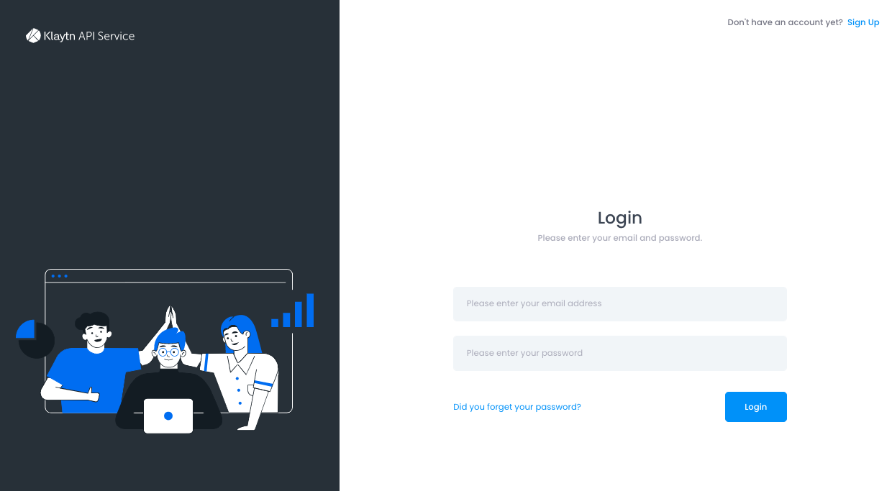
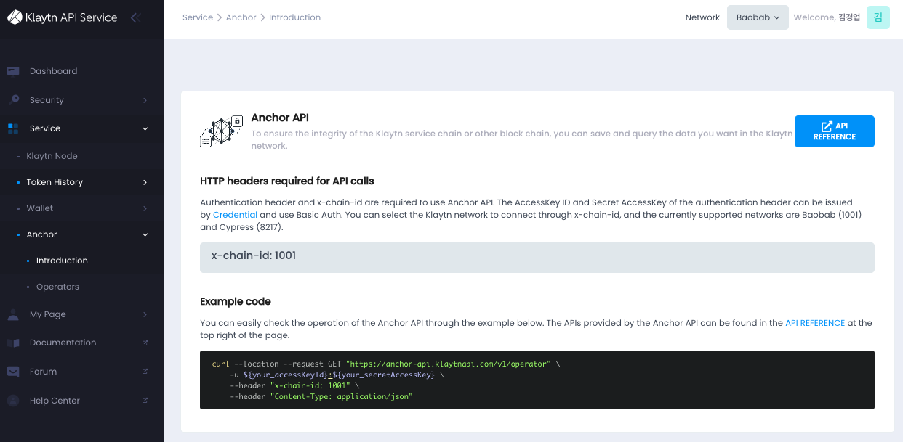
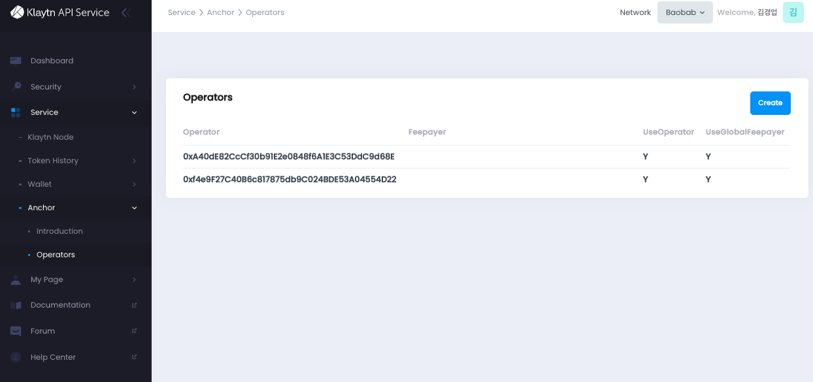

Như đã giải thích trong phần thiết kế, bạn có thể neo dữ liệu chuỗi dịch vụ của mình vào chuỗi chính Klaytn. Trang này giới thiệu cách kích hoạt neo dữ liệu qua [KAS (Klaytn API Service)](https://www.klaytnapi.com).

Khi neo dữ liệu được kích hoạt, một nút trong chuỗi dịch vụ của bạn có thể neo dữ liệu chuỗi (dữ liệu khối) của nó theo định kỳ vào Cypress hoặc Baobab làm bằng chứng cho sự tồn tại và tính bất biến của chuỗi dịch vụ. Điều này đảm bảo tính bảo mật và uy tín của chuỗi dịch vụ.

# Chuẩn bị sử dụng KAS <a id="preparation-with-kas"></a>
Phần này giới thiệu các điều kiện tiên quyết khi sử dụng KAS để neo dữ liệu.

## Đăng ký KAS (Dịch vụ API Klaytn) <a id="sign-up-kas"></a>
Đầu tiên bạn cần đăng nhập KAS trên [KAS console website](https://www.klaytnapi.com) để có tài khoản KAS. Vui lòng truy cập trang web ở trên và đăng ký KAS.

[](https://www.klaytnapi.com)

[](https://www.klaytnapi.com)

## Tạo thông tin đăng nhập <a id="check-credential"></a>
Sau khi đăng nhập, bạn có thể tạo thông tin đăng nhập của mình như bên dưới. `AccessKey ID` và `Secret AccessKey` hoặc `Authorization` sẽ được dùng để gọi API KAS.


## Anchor API <a id="anchor-api"></a>
KAS cung cấp Anchor API được thiết kế để neo dữ liệu; đây chắc chắn là ứng dụng bạn sẽ sử dụng cho tác vụ neo.



## Tạo địa chỉ người vận hành <a id="create-kas-credential"></a>
Để neo dữ liệu chuỗi dịch vụ qua KAS, cần có một địa chỉ Klaytn đăng ký tham gia KAS và thực sự gửi giao dịch neo cho Klaytn. Vì vậy, trước khi thiết lập nút dịch vụ của mình, bạn cần tạo một tài khoản Klaytn mang tên "Người vận hành " qua Kas. Vui lòng sử dụng bảng điều khiển KAS để tạo tài khoản này.

Điều quan trọng bạn cần nhớ: **đầu tiên là chọn chuỗi** trong Klaytn mà bạn muốn neo dữ liệu vào trên **góc trên cùng bên phải của trang bảng điều khiển KAS**. Bạn nên tạo một người vận hành cho mỗi chuỗi (Cypress/Baobab).


Tạo một người vận hành như dưới đây.


Sau đó bạn có thể kiểm tra danh sách người vận hành như bên dưới. Xin lưu ý rằng bắt buộc phải có địa chỉ người vận hành để thiết lập nút chuỗi dịch vụ của bạn.



## Định cấu hình nút chuỗi dịch vụ <a id="configure-service-chain-node"></a>
Sau khi có được thông tin đăng nhập API, thông tin Anchor API (tham số và điểm cuối API) và tài khoản người vận hành trong KAS, bạn có thể thiết lập nút chuỗi dịch vụ của mình. Bạn cần chỉnh sửa tập tin cấu hình (`kscnd.conf`, `kspnd.conf`, `ksend.conf`) của nút chuỗi dịch vụ của bạn như bên dưới.

Bạn nên đặt `SC_SUB_BRIDGE=1` và toàn bộ các mục có tiền tố `SC_KAS_`.

```bash
...
# cài đặt tùy chọn chuỗi dịch vụ
...
SC_SUB_BRIDGE=1
...

SC_KAS_ANCHOR=1                                                         # 1: enable, 0: disable
SC_KAS_ANCHOR_PERIOD=10                                                 # Anchoring block period
SC_KAS_ANCHOR_URL="https://anchor-api.klaytn.com/v1/anchor"             # Anchor API URL
SC_KAS_ANCHOR_OPERATOR="0x6A3D565C4a2a4cd0Fb3df8EDfb63a151717EA1D7"     # Operator address
SC_KAS_ANCHOR_ACCESS_KEY="KAJM4BEIR9SKJKAW1G3TT8GX"                     # Credential Access key
SC_KAS_ANCHOR_SECRET_KEY="KyD5w9ZlZQ7ejj6lDF6elb61u8JH/mXdKqhgr3yF"     # Credential Secret key
SC_KAS_ANCHOR_X_CHAIN_ID=1001                                           # Cypress: 8217, Baobab: 1001
...
```

## Chạy nút chuỗi dịch vụ <a id="run-service-chain-node"></a>
Bây giờ bạn đã sẵn sàng. Bạn có thể chạy nút chuỗi dịch vụ. Bạn sẽ thấy tin nhắn bản ghi liên quan đến Anchor API của KAS như bên dưới.

```bash
...
INFO[09/10,18:09:28 +09] [5] Imported new chain segment                number=86495 hash=5a20d6…cbca1b blocks=1  txs=3 elapsed=2.387ms  trieDBSize=5.10kB mgas=0.063 mgasps=26.383
INFO[09/10,18:09:28 +09] [53] Anchored a block via KAS                  blkNum=86495
INFO[09/10,18:09:29 +09] [5] Imported new chain segment                number=86496 hash=8897bc…4ea7e7 blocks=1  txs=3 elapsed=2.158ms  trieDBSize=5.10kB mgas=0.063 mgasps=29.188
INFO[09/10,18:09:29 +09] [53] Anchored a block via KAS                  blkNum=86496
INFO[09/10,18:09:30 +09] [5] Imported new chain segment                number=86497 hash=44b319…7d4247 blocks=1  txs=3 elapsed=2.346ms  trieDBSize=5.43kB mgas=0.063 mgasps=26.848
INFO[09/10,18:09:30 +09] [53] Anchored a block via KAS                  blkNum=86497
INFO[09/10,18:09:31 +09] [5] Imported new chain segment                number=86498 hash=0b98ba…73d654 blocks=1  txs=3 elapsed=2.235ms  trieDBSize=5.61kB mgas=0.063 mgasps=28.186
INFO[09/10,18:09:31 +09] [53] Anchored a block via KAS                  blkNum=86498
INFO[09/10,18:09:32 +09] [5] Imported new chain segment                number=86499 hash=4f01ab…3bc334 blocks=1  txs=3 elapsed=3.319ms  trieDBSize=5.61kB mgas=0.063 mgasps=18.977
INFO[09/10,18:09:32 +09] [53] Anchored a block via KAS                  blkNum=86499
...
```

## Danh sách giao dịch <a id="list-of-transaction"></a>
Trong trang web bảng điều khiển KAS, bạn có thể xem danh sách các giao dịch neo mà người vận hành chuỗi dịch vụ đã gửi tại menu "Bảng điều khiển KAS - Dịch vụ - Neo - Người vận hành" như bên dưới.


