# Câu hỏi thường gặp 

## Tôi có thể thêm chủ sở hữu sau khi tạo safe không? 

Có! Sau khi tạo tài khoản Safe, Klaytn Safe sẽ cấp cho bạn quyền truy cập để quản lý chủ sở hữu Safe, có nghĩa là thêm, xóa và thay thế chủ sở hữu hoặc đổi tên chủ sở hữu hiện có.

Lưu ý: Để thực hiện thay đổi này, bạn cần kết nối với một trong những chủ sở hữu hiện tại.

Các bước bên dưới sẽ giải thích cách thêm chủ sở hữu hoặc người ký mới vào tài khoản Safe của bạn sau khi tạo.

**Bước 1:** Vào phần *Settings* trong menu thanh bên và chọn phần *Owners*.

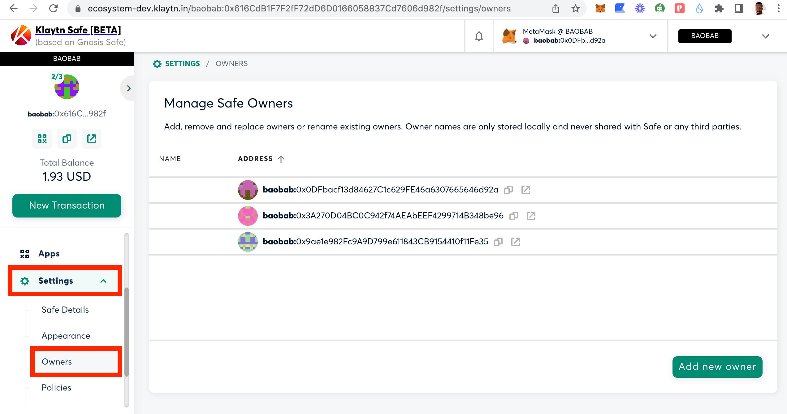

**Bước 2:** Nhấp vào nút **“Add new owner”** ở góc dưới cùng bên phải của trang. Nhấp vào nút này sẽ mở ra một cửa sổ mới.

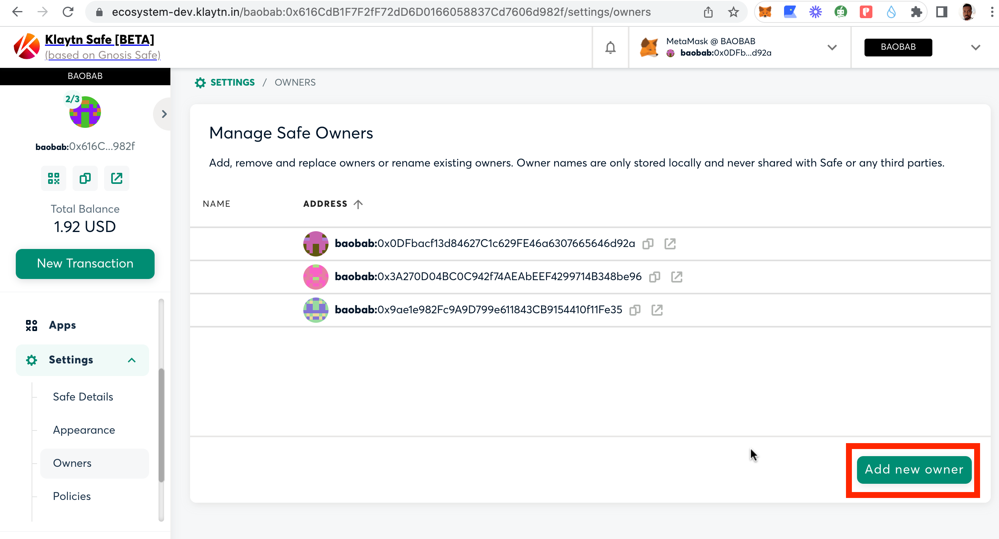

**Bước 3:** Nhập **tên** của chủ sở hữu mới và dán **địa chỉ của chủ sở hữu**. Sau đó nhấp vào nút tiếp theo ở dưới cùng bên phải của trang.

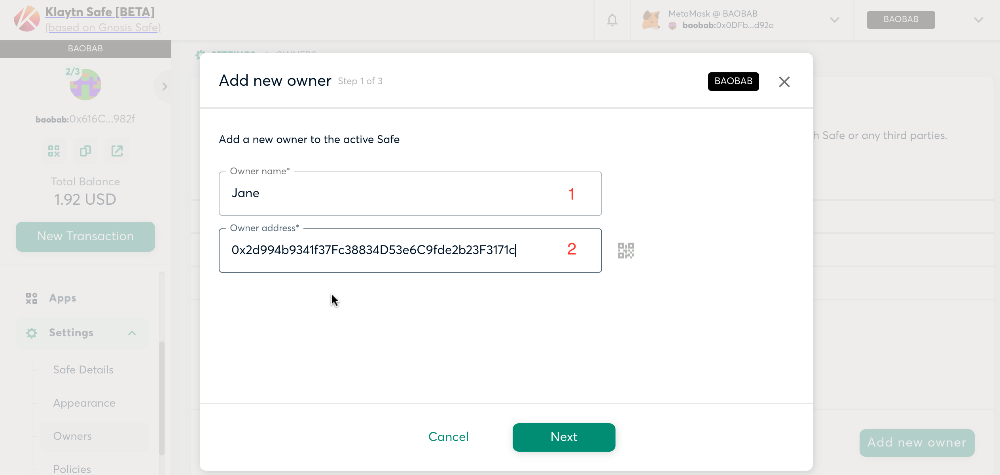

**Bước 4:** Thiết lập chính sách chữ ký mới. Trong trường hợp này, bạn có thể thay đổi hoặc giữ nguyên chính sách chữ ký hiện có. Hình ảnh bên dưới cho thấy 2 trong số 4 chủ sở hữu bắt buộc phải xác nhận và có thể thực hiện bất kỳ giao dịch nào.

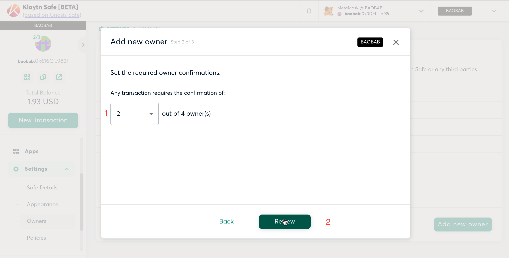

**Bước 5:** Xem lại và gửi giao dịch. Xác nhận rằng tất cả các thay đổi đều chính xác trước khi gửi. Do đó, bạn có thể gửi thay đổi bằng cách nhấp vào nút **Submit**.

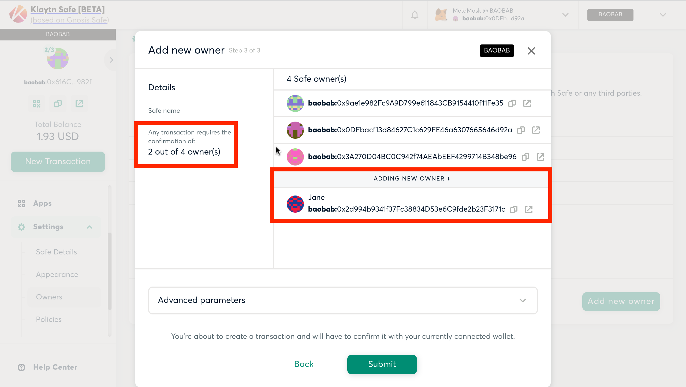

Sau khi nhấp vào “Submit” ví được kết nối của bạn sẽ yêu cầu bạn xác nhận thay đổi. Tùy thuộc vào chính sách chữ ký hiện tại của bạn, các chủ sở hữu khác sẽ phải xác nhận thay đổi tương tự như một giao dịch thông thường.

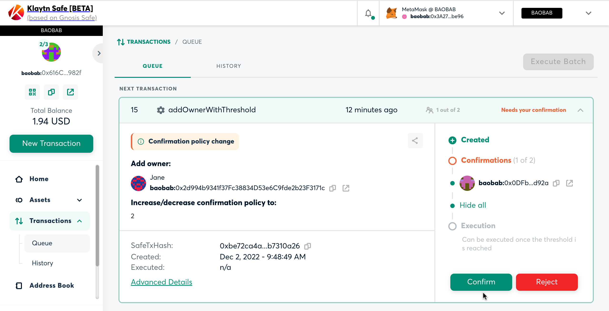

## Tôi có thể thay đổi số lượng người ký xác nhận bắt buộc không? 

Có! Bạn có thể thay đổi số lượng người ký xác nhận bắt buộc bằng cách thực hiện theo các bước được minh họa bên dưới. Điều này quan trọng vì bạn có thể cần thay đổi chủ sở hữu hoặc người ký tên bắt buộc để xác nhận các giao dịch được liên kết với tài khoản Safe của mình.

**Bước 1:** Vào phần *Settings* trong menu thanh bên và chọn phần *Policy*. Phần này sẽ cho bạn thấy chính sách chữ ký hiện tại của mình và từ hình ảnh bên dưới, 2 trong số 4 chủ sở hữu bắt buộc phải xác nhận mọi giao dịch.

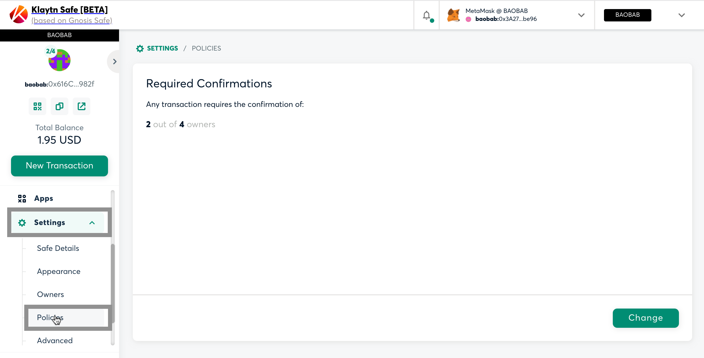

**Bước 2:** Nhấp vào nút **Change**. Thao tác này sẽ bật lên một cửa sổ mới cho phép bạn chọn ngưỡng chữ ký mới của mình.

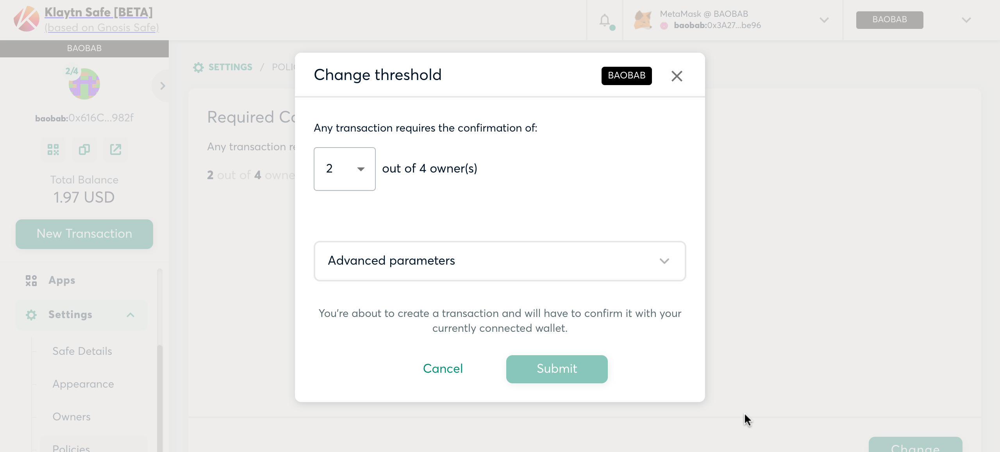

**Bước 3:** Nhấp vào nút **“Submit”**. Lưu ý rằng tùy thuộc vào chính sách chữ ký hiện tại của bạn, các chủ sở hữu khác sẽ phải xác nhận thay đổi tương tự như một giao dịch thông thường.

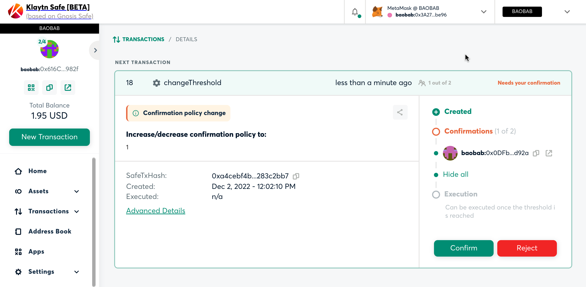

## Làm cách nào để thêm một Safe sẵn có? 

Khi sử dụng địa chỉ Safe, bạn có thể dễ dàng thêm tài khoản Safe của mình. Nhu cầu thêm hoặc tải Safe sẵn có vào giao diện rất đa dạng. Các nhu cầu bao gồm:

* Bạn muốn truy cập Safe từ một trình duyệt khác.
* Bạn muốn tương tác với Safe khi một bên khác đã chỉ định bạn làm chủ sở hữu.
* Bạn muốn thêm Safe sẵn có bất kỳ ở chế độ chỉ đọc.

Hãy thực hiện quy trình thêm Safe sẵn có của bạn theo các bước sau. Lưu ý: Vui lòng đảm bảo rằng ví của người ký của bạn được kết nối.

**Bước 1:** Nhấp vào **“Add Safe”.** Ở góc trên cùng bên trái của menu thanh bên, tìm nút **Add Safe**.

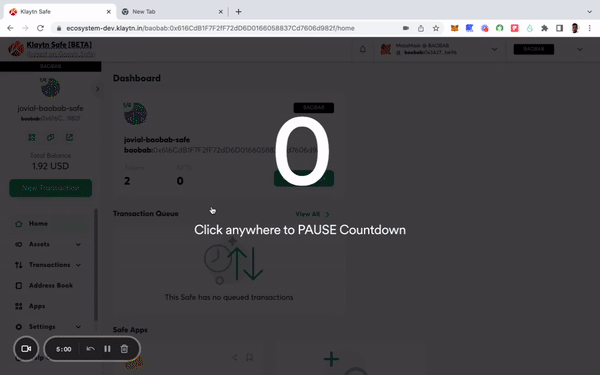

**Bước 2:** Nhấp vào nút **“Add existing safe”**. Thao tác này sẽ bật lên một cửa sổ mới yêu cầu thêm thông tin chi tiết về safe sẵn có. Những thông tin này bao gồm thông tin mạng, tên và địa chỉ của Safe cũng như tên của chủ sở hữu Safe.

Bạn cũng có thể truy cập trang bằng cách nhấp vào [liên kết](https://safe.klaytn.foundation/load) này.

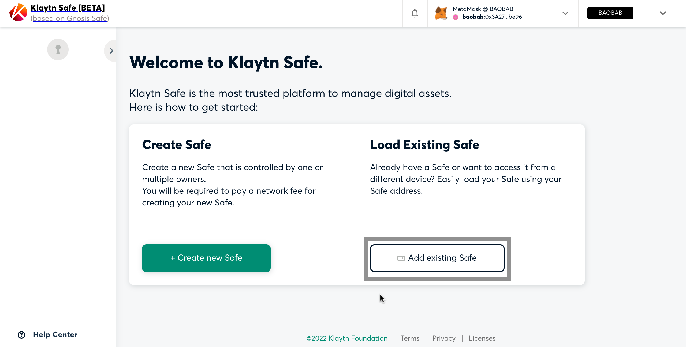

**Bước 3:** Chọn mạng nơi Safe được tạo. Nếu Safe được tạo trên mạng Baobab, hãy nhấp vào tiếp tục; nếu không, hãy chuyển đổi mạng.

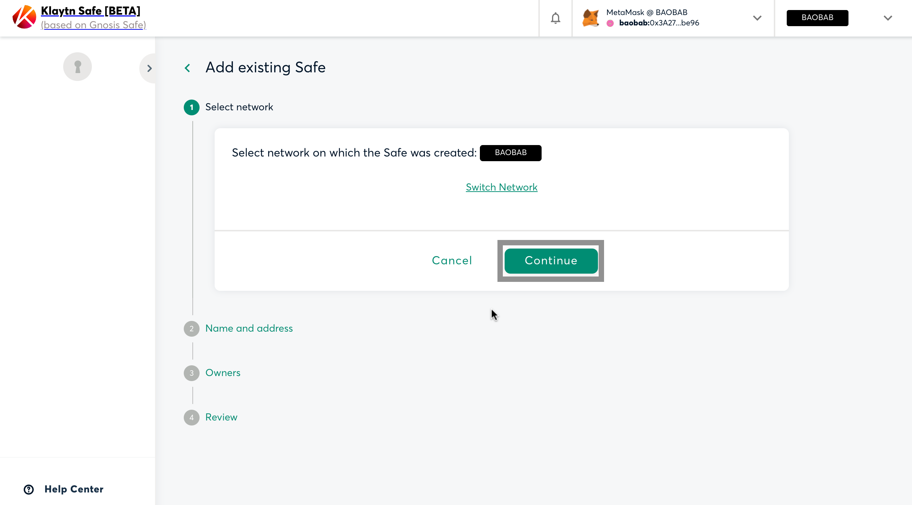

**Bước 4:** Nhập **tên** và **địa chỉ** của Safe. Bạn nên đặt tên cho Safe để dễ nhận biết trong danh sách Safe trên giao diện.

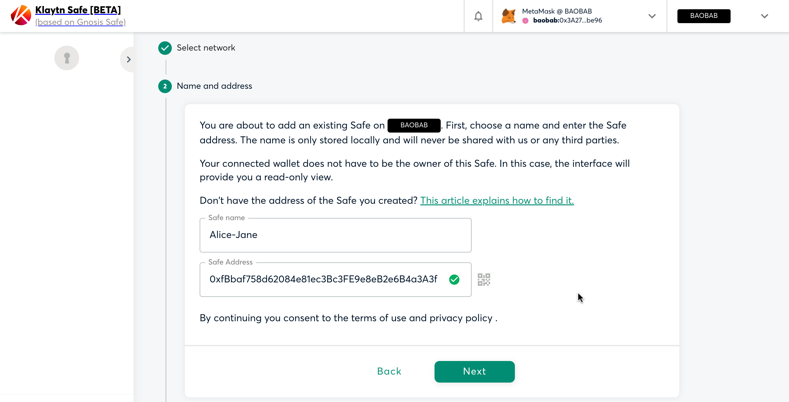

Sau khi đặt tên, dán địa chỉ của Safe bạn muốn thêm vào. Dấu kiểm màu xanh lục cho biết đây đúng là Safe đã được xác minh có thể được thêm vào.

**Bước 5:** Đặt tên cho chủ sở hữu của Safe. Để dễ dàng phân biệt chủ sở hữu Safe của bạn, bạn nên đặt tên riêng cho chủ sở hữu Safe.

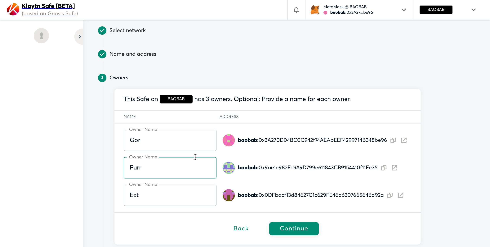

**Bước 6:** Xem lại và thêm. Trước khi thêm Safe, hãy đảm bảo rằng bạn các thông tin cung cấp là chính xác, sau đó tiếp tục và nhấp vào nút “Add”. Sau đó, bây giờ bạn sẽ có quyền truy cập vào tài khoản Safe của mình.

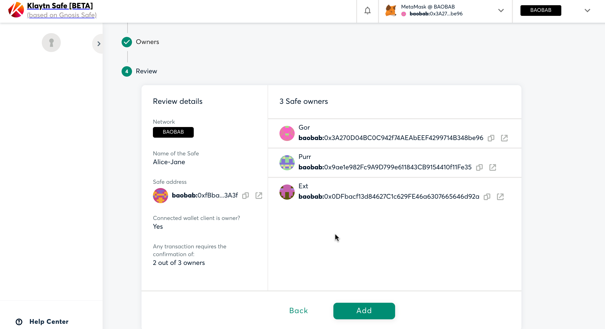

## Thiết lập Safe chung

Thao tác này thường cung cấp một số gợi ý liên quan đến các quyết định cần thực hiện khi thiết lập Safe. Các gợi ý này gồm:

* Bao nhiêu chủ sở hữu?
* Chọn ngưỡng nào?
* Ví nào tương thích?

Không có câu trả lời nào tốt nhất cho ba câu hỏi này, do đó không có một cấu hình Safe tối ưu nào. Câu trả lời thực sự phụ thuộc vào từng trường hợp sử dụng cụ thể. Tuy nhiên, chúng tôi cố gắng đưa ra một số gợi ý về những điều cần lưu ý:

**Bao nhiêu chủ sở hữu?**

Thông thường, việc có nhiều tài khoản chủ sở hữu là một lựa chọn thông minh. Việc cho phép nhiều người có quyền truy cập vào tài khoản Safe khi các nhóm đang quản lý quỹ là một cách rất hay. Các cá nhân quản lý tiền nên có nhiều tài khoản để họ có thể sử dụng nhiều yếu tố xác thực.

**Chọn ngưỡng nào?**

Ngưỡng của Safe là số lượng tài khoản chủ sở hữu tối thiểu phải phê duyệt một giao dịch trước khi giao dịch đó có thể được thực hiện thành công. Nên sử dụng ngưỡng lớn hơn 1, đảm bảo rằng luôn cần ít nhất một tài khoản bổ sung để xác thực và thực hiện các giao dịch Safe thay vì cho phép một tài khoản duy nhất thực hiện giao dịch. Do đó, tiền không thể được chuyển ngay cả khi kẻ tấn công giành được quyền truy cập vào một tài khoản.

Ngoài ra, bạn nên chọn ngưỡng 51% tổng số chủ sở hữu, ví dụ như 2 trên 3, 3 trên 5, v.v. Do đó, ngay cả khi một chủ sở hữu mất quyền truy cập vào tài khoản của họ, người dùng sẽ không bị khóa ngay lập tức hết số tiền của họ trong Safe; thay vào đó, các chủ sở hữu khác vẫn có thể thực hiện các giao dịch và thay thế tài khoản chủ sở hữu bị mất đó. Người ta có thể cho rằng điều này có vai trò như một cơ chế phục hồi.

**Những loại ví nào tương thích?** Hiện tại, Klaytn Safe tương thích với [MetaMask](https://docs.klaytn.foundation/dapp/tutorials/connecting-metamask).